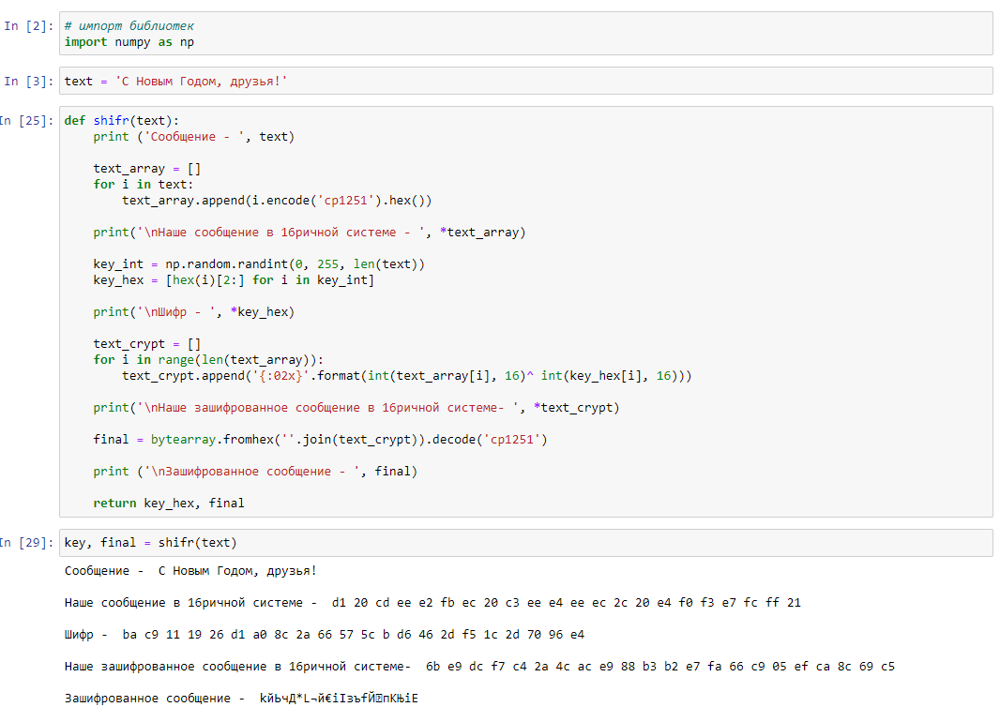
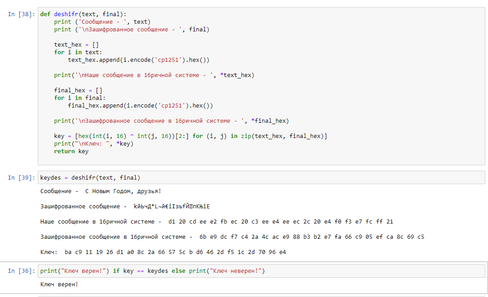

---
# Front matter
title: "Лабораторная работа №7."
subtitle: "Элементы криптографии. Однократное гаммирование"
author: "Силкина Мария Александровна"

# Formatting
toc-title: "Содержание"
toc: true # Table of contents
toc_depth: 2
lof: true # List of figures
lot: true # List of tables
fontsize: 12pt
linestretch: 1.5
papersize: a4paper
documentclass: scrreprt
polyglossia-lang: russian
polyglossia-otherlangs: english
mainfont: PT Serif
romanfont: PT Serif
sansfont: PT Sans
monofont: PT Mono
mainfontoptions: Ligatures=TeX
romanfontoptions: Ligatures=TeX
sansfontoptions: Ligatures=TeX,Scale=MatchLowercase
monofontoptions: Scale=MatchLowercase
indent: true
pdf-engine: lualatex
header-includes:
  - \linepenalty=10 # the penalty added to the badness of each line within a paragraph (no associated penalty node) Increasing the value makes tex try to have fewer lines in the paragraph.
  - \interlinepenalty=0 # value of the penalty (node) added after each line of a paragraph.
  - \hyphenpenalty=50 # the penalty for line breaking at an automatically inserted hyphen
  - \exhyphenpenalty=50 # the penalty for line breaking at an explicit hyphen
  - \binoppenalty=700 # the penalty for breaking a line at a binary operator
  - \relpenalty=500 # the penalty for breaking a line at a relation
  - \clubpenalty=150 # extra penalty for breaking after first line of a paragraph
  - \widowpenalty=150 # extra penalty for breaking before last line of a paragraph
  - \displaywidowpenalty=50 # extra penalty for breaking before last line before a display math
  - \brokenpenalty=100 # extra penalty for page breaking after a hyphenated line
  - \predisplaypenalty=10000 # penalty for breaking before a display
  - \postdisplaypenalty=0 # penalty for breaking after a display
  - \floatingpenalty = 20000 # penalty for splitting an insertion (can only be split footnote in standard LaTeX)
  - \raggedbottom # or \flushbottom
  - \usepackage{float} # keep figures where there are in the text
  - \floatplacement{figure}{H} # keep figures where there are in the text
---

# Цель работы

Освоить на практике применение режима однократного гаммирования. 

# Задачи

1. Определить вид шифротекста при известном ключе и известном открытом тексте.

2. Определить ключ, с помощью которого шифротекст может быть преобразован в некоторый фрагмент текста, представляющий собой один из возможных вариантов прочтения открытого текста.

3. Ответить на контрольные вопросы

# Выполнение лабораторной работы 

##Теоретическая справка

Гаммирование представляет собой наложение (снятие) на открытые (зашифрованные) данные последовательности элементов других данных, полученной с помощью некоторого криптографического алгоритма, для получения зашифрованных (открытых) данных. Иными словами, наложение гаммы — это сложение её элементов с элементами открытого (закрытого) текста по некоторому фиксированному модулю, значение которого представляет собой известную часть алгоритма шифрования

## Выполнение задач 

Первым шагом написала функцию шифрования, которая определяет вид шифротекста при известном ключе и известном открытом тексте "С Новым Годом, друзья!", который был задан по условию. В выводе я получила наш изначальный текст, его вид в шестнадцатеричной системе, рандомный ключ и зашифрованный текст. (рис - @fig:001)

{ #fig:001 width=70% }

Далее я создала функцию для дешифрования, которая определяет ключ, с помощью которого шифротекст может быть преобразован в некоторый фрагмент текста, представляющий собой один из возможных вариантов прочтения открытого текста. (рис - @fig:002)

{ #fig:002 width=70% }

##Контрольные вопросы

1. Однократное гаммирование - выполнение операции XOR между элементами гаммы и элементами подлежащего сокрытию текста. Если в методе шифрования используется однократное гаммирование той же длины, что и подлежащий сокрытию текст, то текст нельзя раскрыть. Даже при раскрытии части последовательности гаммы нельзя получить информацию о всём скрываемом тексте. 

Недостаток однократного гаммирования: 

- Абсолютная стойкость шифра доказана только для случая, когда однократно используемый ключ, длиной, равной длине исходного сообщения, является фрагментом истинно случайной двоичной последовательности с равномерным законом распределения.

3. Преимущества однократного гаммирования: 

- Такой способ симметричен, то есть двойное прибавление одной и той же величины по модулю 2 восстанавливает исходное значение.

- Шифрование и расшифрование может быть выполнено одной и той же программой.

- Криптоалгоритм не даёт никакой информации об открытом тексте: при известном зашифрованном сообщении C все различные ключевые последовательности K возможны и равновероятны, а значит, возможны и любые сообщения P.  

4. Длина открытого текста должна совпадать с длиной ключа, т.к. если ключ короче текста, то операция XOR будет применена не ко всем элементам и конец сообщения будет не закодирован, а если ключ будет длиннее, то появится неоднозначность декодирования. 

5. Операция XOR используется в режиме однократного гаммирования. Наложение гаммы по сути представляет собой выполнение побитовой операции сложения по модулю 2, т.е. мы должны сложить каждый элемент гаммы с соответствующим элементом ключа. Данная операция является симметричной, так как прибавление одной и той же величины по модулю 2 восстанавливает исходное значение.

6. Получение шифротекста по открытому тексту и ключу: $C_i = P_i \oplus K_i$  

7. Получение ключа по окрытому тексту и шифротексту: $K_i = P_i \oplus C_i$  

8. Необходимы и достаточные условия абсолютной стойкости шифра: полная случайность ключа; равенство длин ключа и открытого текста; однократное использование ключа.

# Выводы

Освоила использования однократного гаммирования для шифрования и дешифрования данных.
# Библиография

1. Кулябов Д. С., Королькова А. В., Геворкян М. Н. Информационная безопасность компьютерных сетей. Лабораторная работа № 5. Дискреционное
разграничение прав в Linux. Исследование влияния дополнительных атрибутов.